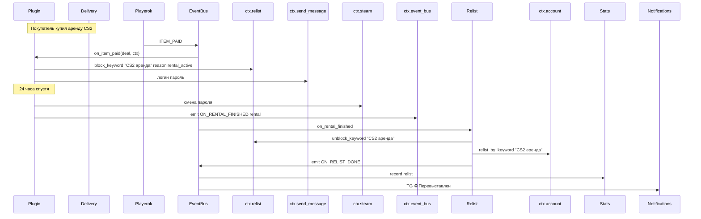

# 🧩 PulseOK — Plugin SDK: преимущества для разработки плагинов

> Это документ-аргумент: что получает разработчик плагина в PulseOK, чего не было в Universal, и какие готовые сценарии ему доступны через ядро.
>
> Связанные документы: [`MASTER_PLAN.md`](MASTER_PLAN.md), [`STAGE_1_CONNECTIVITY.md`](STAGE_1_CONNECTIVITY.md).

---

## Оглавление

- [1. Главная идея: PulseContext](#1-главная-идея-pulsecontext)
- [2. Чего не было в Universal](#2-чего-не-было-в-universal)
- [3. Что плагин может делать через экосистему](#3-что-плагин-может-делать-через-экосистему)
- [4. Восстановление и перевыставление товара из плагина](#4-восстановление-и-перевыставление-товара-из-плагина)
- [5. События, которые плагин может слушать и эмитить](#5-события-которые-плагин-может-слушать-и-эмитить)
- [6. Сравнение с Universal: было / стало](#6-сравнение-с-universal-было--стало)
- [7. Полный пример мини-плагина](#7-полный-пример-мини-плагина)
- [8. Безопасность и изоляция](#8-безопасность-и-изоляция)
- [9. Storage и hot-reload конфига](#9-storage-и-hot-reload-конфига)
- [10. Чек-лист «как сделать платный плагин под PulseOK»](#10-чек-лист-как-сделать-платный-плагин-под-pulseok)

---

## 1. Главная идея: PulseContext

В Universal плагин общается с системой через **глобальные импорты и словари** — каждый плагин сам ищет нужные функции в ядре, копирует утилиты, регистрирует обработчики через словари в `__init__.py`.

В PulseOK плагин получает **один объект `ctx: PulseContext`** при загрузке. Через него доступно всё:

```python
@dataclass
class PulseContext:
    # Движки ядра — публичный API
    delivery:   DeliveryEngine     # автовыдача
    relist:     RelistEngine       # перевыставление
    bump:       BumpEngine         # автоподнятие
    stats:      StatsEngine        # статистика

    # Системные
    config:     ConfigManager      # конфиг с hot-reload
    event_bus:  EventBus           # подписка/эмит событий
    account:    PlayerokAccount    # API Playerok (с CB+RateLimit)
    storage:    PluginStorage      # атомарная запись JSON для плагина
    tg_bot:     Bot | None         # aiogram bot (если нужен прямой доступ)

    # Хелперы
    async def notify(self, text: str) -> None: ...
    async def send_message(self, chat_id: str, text: str) -> None: ...
    def logger(self, name: str = None) -> logging.Logger: ...
    def schedule(self, coro, delay_sec: float) -> asyncio.Task: ...
```

**Что это даёт плагину:**
- Не нужно импортировать `from auto_delivery.delivery import get_engine`
- Не нужно знать структуру файлов ядра
- Не нужно дублировать утилиты типа `_normalize_emoji()`
- Ядро может рефакториться без поломки плагинов — `PulseContext` остаётся стабильным

---

## 2. Чего не было в Universal

| Возможность | Universal | PulseOK |
|---|---|---|
| Единый объект ядра | ❌ глобальные импорты | ✅ `ctx: PulseContext` |
| Изоляция ошибок | ❌ один сломанный handler ломает все | ✅ `try/except` на каждом handler |
| Кросс-движковые вызовы | ❌ копировать код | ✅ `ctx.relist.relist_now(...)` |
| Эмитить свои события в ядро | ❌ только слушать | ✅ `ctx.event_bus.emit(...)` |
| Блокировка/разблокировка перевыставления | ❌ нет API | ✅ `ctx.relist.block_keyword(...)` |
| Атомарная запись данных плагина | ❌ ручной `tempfile + os.replace` | ✅ `ctx.storage.save(key, data)` |
| Hot-reload конфига | ❌ только рестарт | ✅ `ctx.config.watch(callback)` |
| Уведомление админу одной строкой | ❌ свой `_notify_admin()` | ✅ `await ctx.notify(text)` |
| Отправка в чат Playerok одной строкой | ❌ через `plbot.account.send_message` со своим try/except | ✅ `await ctx.send_message(chat_id, text)` (с фолбэками внутри) |
| Логи с правильным префиксом | ❌ `logging.getLogger("моё_имя")` руками | ✅ `ctx.logger("my_plugin.handlers")` |
| Защита от 0-байтовых файлов при крашах | ❌ риск | ✅ всегда `tempfile + os.replace` под капотом |
| Унифицированная обработка эмодзи в названиях | ❌ копировать `_normalize()` | ✅ `from pulseok.utils import normalize_text` |

---

## 3. Что плагин может делать через экосистему

### 3.1 Заказать перевыставление товара

```python
# Старый способ (Universal): копировать сотни строк auto_relist в плагин
# Новый способ (PulseOK):
async def on_my_event(payload, ctx: PulseContext):
    item_id = payload["item_id"]
    success, reason = await ctx.relist.relist_item(item_id)
    if success:
        await ctx.notify(f"♻️ Товар {item_id} перевыставлен")
```

### 3.2 Заблокировать/разблокировать перевыставление по ключевому слову

Плагин аренды Steam-аккаунтов даёт аккаунт в аренду на 24 часа. Пока аренда активна — товар не должен перевыставляться.

```python
# В начале аренды
ctx.relist.block_keyword("CS2 аренда", reason="rental_active", until=time.time() + 24*3600)

# В конце аренды (или явно через !возврат)
ctx.relist.unblock_keyword("CS2 аренда")
# И сразу запросить перевыставление, раз товар освободился
await ctx.relist.relist_by_keyword("CS2 аренда")
```

### 3.3 Создать/удалить товар через автовыдачу

```python
# Плагин выдачи кодов добавил новую партию ключей
ctx.delivery.add_items_to_cell(
    cell_name="GTA 5",
    items=["KEY1-XXXX-XXXX", "KEY2-YYYY-YYYY", ...]
)
# Если ячейка пустая → автоматически разблокируется relist для неё
```

### 3.4 Запросить автоподнятие сейчас

```python
# Плагин видит, что товар упал в позиции — поднимаем
ctx.bump.bump_now(item_id, mode="auto")
```

### 3.5 Записать продажу в статистику

```python
# Плагин выдал товар → запишет продажу в общий журнал stats
ctx.stats.record_sale(
    item_name="Steam Rental 24h",
    revenue=450,
    cost=0,
    source="steam_rental_pro",
    deal_id=deal.id,
)
```

### 3.6 Уведомить админа

```python
await ctx.notify("⚠️ Закончились свободные аккаунты в категории CS2!")
# → пушится во все admin_ids автоматически
# → внутри уже try/except, fallback'и, форматирование
```

### 3.7 Отправить сообщение покупателю в Playerok

```python
await ctx.send_message(chat_id, "✅ Готово! Логин: {login}, пароль: {password}")
# → внутри:
#   1. попытка через plbot.send_message (быстрая)
#   2. fallback на account.send_message напрямую
#   3. retry x3 с backoff
#   4. лог + уведомление админу при провале
```

### 3.8 Запросить выдачу как страховку (cross-call с delivery)

Плагин Steam Rental Pro обнаружил, что нужно отдать стандартный код Steam Guard, и хочет, чтобы delivery-движок тоже об этом знал (для статистики). Эмитит событие:

```python
await ctx.event_bus.emit("PLUGIN_DELIVERY_DONE", {
    "plugin": "steam_rental_pro",
    "deal_id": deal.id,
    "item_name": item_name,
    "ok": True,
})
# stats и notifications подхватывают
```

---

## 4. Восстановление и перевыставление товара из плагина

Это самое важное для аренды/подписок. У плагина 4 способа управлять жизненным циклом своего товара через ядро:

### 4.1 Прямой relist по item_id

```python
success, reason = await ctx.relist.relist_item(item_id)
```

`relist.relist_item` под капотом делает все 4 фикса:
- `account.get_item(id=item_id)` — refresh схемы
- `account.get_all_my_items(status=SOLD)` — пагинация
- name-match приоритет, id-fallback
- исключение APPROVED-кандидатов

### 4.2 Relist по keyword (имени) с поиском подходящего товара

```python
# Плагин знает только название, не id (товар каждый раз новый id после publish)
await ctx.relist.relist_by_keyword("CS2 24 часа", priority="auto")
```

### 4.3 Подписка на ON_RENTAL_FINISHED — авто-relist

В плагине:
```python
EVENT_HANDLERS = {"ON_RENTAL_FINISHED": [on_rental_finished]}

async def on_rental_finished(rental, ctx: PulseContext):
    # Эмитим в ядро — relist движок сам подхватит
    await ctx.event_bus.emit("ON_STOCK_REFILL", {
        "keyword": rental.item_name,
        "source": "rental_returned",
    })
```

`relist` подписан на `ON_STOCK_REFILL` — снимает блокировку и перевыставляет автоматически.

### 4.4 Авто-блок при стоке=0 без ручного вмешательства

Когда delivery-движок видит `stock=0`, эмитится `ON_STOCK_EMPTY(cell)`. relist подписан и автоматически вызывает `block_keyword(cell.name)`. Плагин **не делает ничего** — экосистема сама синхронизируется.

Но если плагин хочет ручной контроль — он может:

```python
# Принудительная блокировка вне зависимости от стока
ctx.relist.block_keyword("Premium бот", reason="manual_disabled_by_admin")

# Снятие
ctx.relist.unblock_keyword("Premium бот")
```

### 4.5 Цепочка событий (полный жизненный цикл)



---

## 5. События, которые плагин может слушать и эмитить

### 5.1 Что плагин слушает (системные события)

| Событие | Когда срабатывает | Payload |
|---|---|---|
| `ITEM_PAID` | Сделка оплачена | `Deal` |
| `NEW_DEAL` | Новая сделка появилась | `Deal` |
| `DEAL_STATUS_CHANGED` | Изменился статус сделки | `Deal` |
| `NEW_MESSAGE` | Сообщение в чате | `Message, Chat` |
| `ON_STOCK_EMPTY` | Ячейка delivery опустела | `Cell` |
| `ON_STOCK_REFILL` | Ячейка пополнена | `Cell` |
| `ON_RELIST_DONE` | Relist выполнил перевыставление | `Item, mode` |
| `ON_BUMP_DONE` | Поднятие выполнено | `Item, dict` |
| `RECOVERY_DEAL_FOUND` | RecoveryPoller нашёл пропуск WS | `Deal` |

### 5.2 Что плагин эмитит (свои события)

Плагин может эмитить любые свои события. Имена начинаются с префикса плагина:

```python
await ctx.event_bus.emit("STEAM_RENTAL_STARTED", rental)
await ctx.event_bus.emit("STEAM_RENTAL_FINISHED", rental)
await ctx.event_bus.emit("STEAM_GUARD_REQUESTED", chat_id, login)
```

Другие плагины могут на них подписываться. Например, плагин аналитики может слушать `STEAM_RENTAL_*` и считать конверсию.

### 5.3 Стандартные хуки для интеграции с ядром

Если плагин хочет дать ядру правильные сигналы (чтобы relist/stats/etc. работали корректно) — эмитит стандартные:

| Эмит плагина | Реакция ядра |
|---|---|
| `ON_STOCK_REFILL(keyword)` | relist разблокирует и перевыставит |
| `PLUGIN_DELIVERY_DONE(plugin, deal, ok)` | stats запишет продажу |
| `PLUGIN_ITEM_LOCKED(item_id, until)` | relist знает не трогать этот товар |
| `PLUGIN_ITEM_UNLOCKED(item_id)` | relist разблокирует |

---

## 6. Сравнение с Universal: было / стало

### Сценарий: «Плагин аренды получил оплату → выдать аккаунт → через 24ч вернуть → перевыставить лот»

#### Universal-стиль

```python
# В __init__.py плагина
PLAYEROK_EVENT_HANDLERS = {EventTypes.ITEM_PAID: [on_item_paid]}

# В handlers.py
import logging, threading, time
from auto_delivery.delivery import get_engine  # КОПИРОВАНИЕ
from auto_relist.engine import relist_sold      # КОПИРОВАНИЕ — НО ОНО СЛОМАНО

logger = logging.getLogger("steam_rental_pro")

def on_item_paid(deal):
    # Сами делаем threading, чтобы не блочить главный цикл
    threading.Thread(
        target=_handle_paid_sync,
        args=(deal,),
        daemon=True
    ).start()

def _handle_paid_sync(deal):
    try:
        # 1. Свой код выдачи (~200 строк)
        # ...
        # 2. Ждём 24 часа в этом же потоке
        time.sleep(24 * 3600)
        # 3. Меняем пароль
        # ...
        # 4. Перевыставляем (но relist сломан, копируем фикс из tools)
        from playerokapi.account import Account
        # сами достаём аккаунт из глобалки
        acc = Account(...)  # надо хранить ссылку
        # сами вызываем relist (с риском ошибиться)
        items = acc.get_my_items()  # БАГ: только 12 штук
        # ... ещё 100 строк ...
    except Exception as e:
        logger.error(e)  # никто не увидит
        # admin не уведомлён, плагин зависает молча
```

**Проблемы:**
- Плагин дублирует код auto_delivery, auto_relist
- Нет уведомления админа при ошибках
- relist может выбрать APPROVED → схема API ошибка
- Не учитывается пагинация → товар не найден
- Если ядро обновится — плагин сломается

#### PulseOK-стиль

```python
# В __init__.py плагина
EVENT_HANDLERS = {"ITEM_PAID": [on_item_paid]}

# В handlers.py
async def on_item_paid(deal, ctx: PulseContext):
    log = ctx.logger("rental")
    rental_keyword = deal.item.name

    # 1. Блокируем relist на время аренды
    ctx.relist.block_keyword(rental_keyword, reason="rental")

    # 2. Выдаём аккаунт
    account_data = ctx.storage.load("accounts").pop_free(category="cs2")
    await ctx.send_message(deal.chat.id, f"Логин: {account_data.login}")

    # 3. Записываем в stats
    ctx.stats.record_sale(item_name=rental_keyword, revenue=deal.price, source="rental")

    # 4. Через 24ч — авто-возврат
    ctx.schedule(_finish_rental(deal, account_data, ctx), delay_sec=24*3600)

async def _finish_rental(deal, account, ctx):
    # 1. Меняем пароль (своя логика)
    account.password = generate_random()

    # 2. Эмитим событие — ядро само сделает relist
    await ctx.event_bus.emit("ON_STOCK_REFILL", {
        "keyword": deal.item.name,
        "source": "rental_returned",
    })
    # Всё. Relist разблокировал keyword + перевыставил автоматически.
    # Stats записала факт relist'а. Notifications послали админу TG.

    await ctx.notify(f"✅ Аренда {deal.item.name} завершена, аккаунт возвращён")
```

**Что мы получили:**
- 30 строк вместо 300+
- Ошибка в любом месте → `try/except` ядра ловит, лог, уведомление админу
- Relist гарантированно работает (4 фикса в ядре)
- При обновлении ядра — плагин не ломается (контракт стабилен)

---

## 7. Полный пример мини-плагина

```python
# modules/example_voucher/__init__.py
from .handlers import on_item_paid, on_message, on_init

EVENT_HANDLERS = {
    "ITEM_PAID":   [on_item_paid],
    "NEW_MESSAGE": [on_message],
}

INIT_HANDLERS = [on_init]

# meta.py
NAME = "Example Voucher"
SLUG = "example_voucher"
VERSION = "1.0.0"
ICON = "🎁"
AUTHOR = "yargl"
```

```python
# modules/example_voucher/handlers.py
import asyncio
from pulseok.core import PulseContext

async def on_init(ctx: PulseContext):
    log = ctx.logger("example_voucher")
    log.info("Voucher плагин загружен")
    # читаем свои настройки
    cfg = ctx.config.get("modules.example_voucher", {})
    if not cfg.get("api_key"):
        await ctx.notify("⚠️ Voucher: отсутствует api_key, плагин уснёт")
        ctx.modules.disable("example_voucher")

async def on_item_paid(deal, ctx: PulseContext):
    log = ctx.logger("example_voucher")
    if "ваучер" not in deal.item.name.lower():
        return  # не наш товар

    # 1. Покупаем у внешнего API
    voucher = await fetch_voucher_from_api(deal.price)
    if not voucher:
        await ctx.notify(f"❌ Voucher: не удалось купить ваучер для сделки {deal.id}")
        return

    # 2. Отдаём покупателю
    await ctx.send_message(deal.chat.id, f"🎁 Ваш ваучер: {voucher.code}")

    # 3. Регистрируем в stats
    ctx.stats.record_sale(
        item_name=deal.item.name,
        revenue=deal.price,
        cost=voucher.cost,
        source="example_voucher",
        deal_id=deal.id,
    )

    # 4. Подтверждаем сделку
    ctx.account.update_deal(deal.id, status="CONFIRMED")

    # 5. Кросс-call: запросить relist (товар продан, нужно выложить заново)
    await ctx.event_bus.emit("ON_STOCK_REFILL", {
        "keyword": deal.item.name,
        "source": "voucher_sold",
    })

async def on_message(msg, chat, ctx: PulseContext):
    if msg.text and msg.text.startswith("!ваучер"):
        await ctx.send_message(chat.id, "Доступные ваучеры: /vouchers ...")
```

**Структура плагина:**
```
modules/example_voucher/
├── __init__.py        # EVENT_HANDLERS, INIT_HANDLERS
├── meta.py            # NAME, VERSION, ICON
├── handlers.py        # бизнес-логика
├── api_client.py      # внешнее API
├── config.py          # дефолтные настройки
├── requirements.txt   # ядро поставит при загрузке
└── PATCHNOTES.md
```

---

## 8. Безопасность и изоляция

### 8.1 Падение плагина не валит ядро

```python
# В EventBus._safe()
try:
    await handler(*payload, ctx)
except Exception:
    log.exception(f"Plugin {handler.__module__} failed on {event}")
    # Уведомление админу опционально
```

### 8.2 Уникальные callback-префиксы в TG

Плагин **обязан** использовать уникальный префикс для callback-data:

```python
# ❌ НЕЛЬЗЯ — другой плагин с такой же кнопкой перехватит
builder.button(text="Меню", callback_data="menu")

# ✅ НАДО
builder.button(text="Меню", callback_data="ev:menu")  # ev = example_voucher
```

ModuleLoader **проверяет** при загрузке: если плагин регистрирует callback без префикса — выдаёт `WARNING` в логе.

### 8.3 disable_module / enable_module

Плагин может сам выключиться при ошибке настройки:

```python
async def on_init(ctx):
    if not ctx.config.get(f"modules.{SLUG}.api_key"):
        await ctx.notify(f"⚠️ {NAME}: нет api_key, ухожу спать")
        ctx.modules.disable(SLUG)
```

Админ через TG-меню «🔌 Модули» включает обратно когда настроит ключ.

### 8.4 Storage в собственной папке

Плагин не лезет в `data/` ядра напрямую. Использует:

```python
ctx.storage.save("rentals", {"active": [...], "history": [...]})
data = ctx.storage.load("rentals", default={"active": [], "history": []})
# → пишется в data/modules/example_voucher/rentals.json атомарно
```

---

## 9. Storage и hot-reload конфига

### 9.1 PluginStorage API

```python
class PluginStorage:
    def save(self, key: str, data: dict | list) -> None:
        """Атомарная запись в data/modules/{plugin_slug}/{key}.json"""
    def load(self, key: str, default=None) -> dict | list:
        """Читает или возвращает default"""
    def delete(self, key: str) -> None: ...
    def list_keys(self) -> list[str]: ...
    def path(self, key: str = None) -> Path: ...
```

Атомарность под капотом (`tempfile + os.replace`) — плагин не может случайно создать 0-байтный файл.

### 9.2 Hot-reload конфига

```python
# Плагин подписывается на изменение своей секции
def on_config_change(new_cfg):
    log.info(f"Config changed, new api_key={new_cfg.get('api_key')[:5]}...")

ctx.config.watch(f"modules.{SLUG}", on_config_change)
```

При сохранении нового `config.json` через TG-настройки → плагин получает событие → может пересоздать клиент API без рестарта бота.

---

## 10. Чек-лист «как сделать платный плагин под PulseOK»

```markdown
[ ] modules/<my_plugin>/ создан
[ ] meta.py: NAME, SLUG, VERSION, ICON, AUTHOR
[ ] requirements.txt: только новые библиотеки (aiogram/aiohttp уже в ядре)
[ ] __init__.py: EVENT_HANDLERS / INIT_HANDLERS / TELEGRAM_BOT_ROUTERS
[ ] PATCHNOTES.md создан
[ ] Все хендлеры принимают ctx: PulseContext последним параметром
[ ] Все callback_data имеют уникальный префикс (например, "vc:")
[ ] Плагин использует ctx.notify(), ctx.send_message(), ctx.logger()
[ ] Плагин использует ctx.storage вместо open(...)
[ ] Плагин использует ctx.config.get() вместо чтения JSON напрямую
[ ] Плагин эмитит ON_STOCK_REFILL после возврата товара (если применимо)
[ ] При отсутствии обязательной настройки плагин делает ctx.modules.disable(SLUG)
[ ] Если плагин делает HTTP вызовы — оборачивает в try/except + ctx.notify
[ ] Никаких print() — только ctx.logger
[ ] Никаких time.sleep() в event handlers — только ctx.schedule(...)
```

---

## 11. Итоговый список «фишек» PulseOK для плагинов

**Архитектурные:**
- 🔌 `PulseContext` как единая точка доступа ко всему ядру
- 🛡 Изоляция ошибок: один плагин не валит остальных
- 🔄 Hot-reload конфига без рестарта бота
- 💾 Атомарная запись данных плагина

**Кросс-модульные:**
- ♻️ `ctx.relist.relist_item(id)` — заказать перевыставление
- 🔒 `ctx.relist.block_keyword(name, reason)` / `unblock_keyword(name)` — управлять видимостью
- 📦 `ctx.delivery.add_items_to_cell(...)` — пополнить запас выдачи
- ⬆️ `ctx.bump.bump_now(item_id)` — поднять товар сейчас
- 📊 `ctx.stats.record_sale(...)` — записать продажу в общий журнал

**Коммуникация:**
- 📨 `await ctx.notify(text)` — уведомить админа в TG
- 💬 `await ctx.send_message(chat_id, text)` — отправить в Playerok с retry+fallback
- 📡 `ctx.event_bus.emit(...)` — широковещательное событие в ядро и другие плагины
- 👂 Подписка на любые события ядра через `EVENT_HANDLERS`

**Системные:**
- 📝 `ctx.logger(name)` — единый формат логов с правильным префиксом
- ⏰ `ctx.schedule(coro, delay_sec)` — отложенная задача без блокировки event loop
- 🛡 Всё проходит через Circuit Breaker и RateLimiter автоматически
- 🔁 Recovery Poller ловит пропуски WS — плагин получает событие даже если WS моргнул

**Качество:**
- ✅ Никаких 0-байтовых файлов после краша
- ✅ Никаких потерянных WS-событий после reconnect
- ✅ Никаких race conditions при одновременной выдаче
- ✅ Никаких сломанных меню из-за пересечения callback'ов плагинов

---

**Резюме одной строкой:** в PulseOK плагин делает свою бизнес-логику, а всё остальное — выдачу/возврат товара, статистику, уведомления, защиту от ошибок — берёт у ядра в готовом виде. Это уменьшает объём кода плагина в 5–10 раз и устраняет целый класс багов «забыл что-то проверить».
