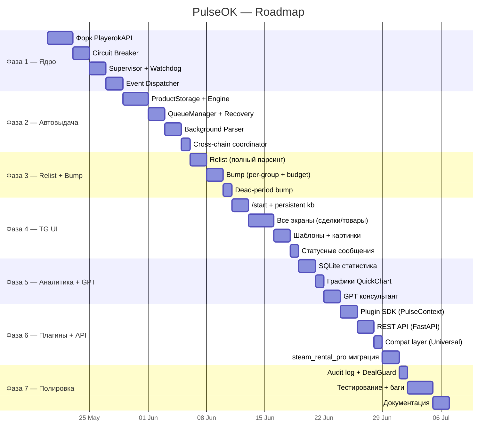
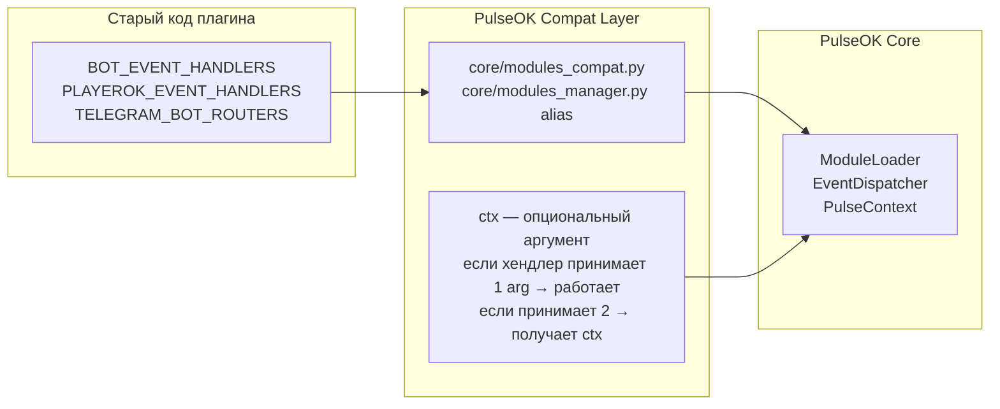

# ⚡ PulseOK — v7 Final Plan

---

## 🗺 Roadmap



---

## Архитектура плагинов

### Что не так в Universal

В Universal у плагинов **только 3 точки входа** и **нет доступа к ядру:**

```python
# Сейчас плагин не может:
# ❌ Выдать товар из DeliveryEngine
# ❌ Записать продажу в статистику
# ❌ Послать уведомление в TG из хендлера
# ❌ Поставить товар в очередь на bump
# ❌ Заблокировать relist (например, если аккаунт ещё занят в Steam Rental)
# ❌ Узнать статус Circuit Breaker / здоровье бота
```

### PulseContext — Service Locator

Каждый хендлер плагина получает `ctx: PulseContext` — объект со всеми сервисами ядра:

```python
# Пример хендлера плагина в PulseOK:
async def on_item_paid(event, ctx: PulseContext):
    # Автовыдача из ячейки
    cell = ctx.delivery.match_cell(event.deal.item.name)
    if cell:
        result = ctx.delivery.deliver(cell, buyer=event.deal.buyer.username)

    # Записать продажу в единую статистику
    ctx.stats.record(amount=event.deal.price, item=event.deal.item.name, source="steam_rental")

    # Уведомление в TG
    await ctx.notify("🎮 Steam-аккаунт выдан!")

    # Отправить сообщение покупателю в Playerok
    await ctx.send_message(event.chat.id, "Ваш аккаунт готов!")

    # Поставить товар на bump после выдачи
    ctx.bump.schedule(event.deal.item.id, delay_sec=300)

    # Заблокировать relist (аккаунт занят)
    ctx.relist.block(item_id=event.deal.item.id, reason="steam_rental_active")
```

```python
# PulseContext — полный интерфейс
class PulseContext:
    delivery: DeliveryAPI      # выдача товаров
    stats:    StatsAPI         # запись и чтение статистики
    bump:     BumpAPI          # управление поднятием
    relist:   RelistAPI        # управление перевыставлением
    account:  AccountAPI       # Playerok API (get_deals, send_message и т.д.)
    bot:      BotStatusAPI     # статус бота, health, uptime
    notify:   Callable         # отправить уведомление в TG
    send_message: Callable     # отправить сообщение в Playerok чат
    config:   ConfigAPI        # чтение/запись конфига плагина
```

---

### Новые BOT-события (которых нет в Universal)

```python
BOT_EVENT_HANDLERS = {
    # ── Старые (100% совместимость) ──────────────────────────
    "ON_MODULE_ENABLED":        [...],
    "ON_MODULE_DISABLED":       [...],
    "ON_PLAYEROK_BOT_INIT":     [...],
    "ON_TELEGRAM_BOT_INIT":     [...],

    # ── НОВЫЕ ────────────────────────────────────────────────
    "ON_DELIVERY_COMPLETE":     [...],  # товар выдан успешно
    "ON_DELIVERY_FAILED":       [...],  # выдача не удалась (все retry)
    "ON_STOCK_EMPTY":           [...],  # запас ячейки стал 0
    "ON_STOCK_LOW":             [...],  # запас ниже threshold
    "ON_RELIST_COMPLETE":       [...],  # товар перевыставлен
    "ON_RELIST_BLOCKED":        [...],  # relist заблокирован (нет запаса)
    "ON_BUMP_COMPLETE":         [...],  # товар поднят
    "ON_WITHDRAWAL":            [...],  # вывод средств выполнен
    "ON_BOT_HEALTH_CHANGE":     [...],  # RUNNING→DEGRADED или обратно
    "ON_CHAT_OPENED":           [...],  # первый контакт с покупателем
    "ON_BEFORE_DELIVERY":       [...],  # хук до выдачи (можно отменить/изменить)
}
```

### Новые Playerok-события

```python
PLAYEROK_EVENT_HANDLERS = {
    # ── Старые ───────────────────────────────────────────────
    EventTypes.NEW_MESSAGE:                 [...],
    EventTypes.NEW_DEAL:                    [...],
    EventTypes.DEAL_STATUS_CHANGED:         [...],
    EventTypes.ITEM_PAID:                   [...],
    EventTypes.DEAL_CONFIRMED:              [...],
    EventTypes.DEAL_CONFIRMED_AUTOMATICALLY:[...],
    EventTypes.DEAL_ROLLED_BACK:            [...],
    EventTypes.DEAL_HAS_PROBLEM:            [...],
    EventTypes.DEAL_PROBLEM_RESOLVED:       [...],
    EventTypes.ITEM_SENT:                   [...],
    EventTypes.CHAT_INITIALIZED:            [...],

    # ── НОВЫЕ ────────────────────────────────────────────────
    EventTypes.ITEM_RESTORED:               [...],  # товар восстановлен
    EventTypes.ITEM_BUMPED:                 [...],  # товар поднят
    EventTypes.NEW_REVIEW:                  [...],  # новый отзыв
}
```

---

### REST API эндпоинты (FastAPI, localhost:8412)

Плагины могут обращаться к ним через `httpx` — это делает интеграцию максимально простой даже для внешних скриптов.

```
Автовыдача:
  GET  /api/delivery/cells                  Список всех ячеек
  GET  /api/delivery/cells/{id}             Конкретная ячейка
  GET  /api/delivery/cells/{id}/stock       Количество товаров в запасе
  POST /api/delivery/deliver                Выдать товар из ячейки
  POST /api/delivery/queue/add              Добавить в очередь вручную
  GET  /api/delivery/queue                  Статус очереди (активные/ошибки)
  POST /api/delivery/relist-block/{id}      Заблокировать relist товара

Статистика:
  GET  /api/stats/summary                   Выручка за периоды
  GET  /api/stats/top                       Топ товаров
  GET  /api/stats/chart                     Данные для графика
  POST /api/stats/record                    Записать продажу (из плагина)

Bump / Relist:
  POST /api/bump/queue                      Поставить товар на bump
  POST /api/bump/now/{id}                   Поднять товар немедленно
  POST /api/relist/now/{id}                 Перевыставить товар немедленно

Чат / Уведомления:
  POST /api/chat/{id}/send                  Отправить сообщение в Playerok чат
  POST /api/notify                          Послать уведомление в TG
  POST /api/notify/admin                    Послать уведомление конкретному admin

Состояние бота:
  GET  /api/bot/status                      Uptime, WS/HTTP статус, Circuit Breaker
  POST /api/bot/restart                     Перезапустить ядро
  POST /api/modules/{uuid}/reload           Перезагрузить плагин

Аккаунт (проксирование Playerok API):
  GET  /api/account/info                    Данные аккаунта, баланс
  GET  /api/account/deals                   Список сделок (с фильтром)
  GET  /api/account/items                   Список товаров (с фильтром)
  GET  /api/account/chats                   Список чатов
```

---

### Обратная совместимость (steam_rental_pro)



| Плагин | Нужны правки? | Что получает |
|---|---|---|
| `steam_rental_pro` | ❌ Нет | Работает as-is, ctx доступен если добавить аргумент |
| `gpt_consultant` | ❌ Нет | То же |
| `auto_delivery` | — | Логика встроена в ядро |
| `auto_relist` | — | Логика встроена в ядро |
| Новый плагин | — | Полный ctx + все новые события |

---

## Полный список фич (73)

### 🧠 Ядро (1–8)
| # | Фича |
|---|---|
| 1 | Supervisor — watchdog, авто-restart <5 сек |
| 2 | Circuit Breaker — CLOSED→OPEN→HALF_OPEN |
| 3 | Exponential Backoff WS reconnect |
| 4 | Health Dashboard в /start |
| 5 | Graceful Shutdown |
| 6 | Proxy Monitor каждые 5 мин |
| 7 | Session Refresh по расписанию |
| 8 | Crash Recovery при старте |

### 📦 Автовыдача (9–19)
| # | Фича |
|---|---|
| 9 | Ячейки: CRUD + keywords any/all/exact |
| 10 | FIFO Stock, бесконечные ячейки (∞) |
| 11 | items_per_order |
| 12 | Recovery Queue: 5×2мин + 6×5мин |
| 13 | Парсер пропущенных сделок (каждые 5 мин) |
| 14 | Ежедневный бекап товаров в TG |
| 15 | Cross-chain: stock==0 → блок relist + алерт |
| 16 | Stock Alert при stock < threshold |
| 17 | Auto-confirm per-cell |
| 18 | Подпись — отдельное сообщение |
| 19 | Auto-response per-cell |

### ♻️ Перевыставление (20–26)
| # | Фича |
|---|---|
| 20 | Полный парсинг — пагинация ALL (не 12) |
| 21 | Included/Excluded + загрузка из .txt |
| 22 | Sold/Expired раздельно |
| 23 | Stock-aware: координация с Delivery |
| 24 | Post-relist bump (опция) |
| 25 | Delayed relist |
| 26 | Relist-block API из плагинов |

### ⬆️ Автоподнятие (27–34)
| # | Фича |
|---|---|
| 27 | Per-group расписание (разные интервалы) |
| 28 | Included/Excluded + загрузка из .txt |
| 29 | Дневной бюджет (₽) |
| 30 | Dead-period bump (N дней без продаж) |
| 31 | Smart Bump (приоритет по просмотрам) |
| 32 | Bump Calendar (активные часы) |
| 33 | Ручной bump из TG |
| 34 | Priority Status при поднятии |

### 💬 Чат / Сообщения (35–48)
| # | Фича |
|---|---|
| 35 | Шаблоны (fast_replies) — кнопка «📋 Шаблоны» |
| 36 | first_message (приветствие) |
| 37 | new_deal (оплата) |
| 38 | deal_sent (подтверждение) |
| 39 | deal_confirmed |
| 40 | deal_refunded |
| 41 | deal_has_problem + per-product текст |
| 42 | new_review |
| 43 | cmd_error |
| 44 | cmd_seller (вызов продавца) |
| 45 | Кастомные команды (!команда → ответ) |
| 46 | Картинки: Playerok → TG фото |
| 47 | Авто-чтение чата |
| 48 | Водяной знак |

### 📊 Данные (49–55)
| # | Фича |
|---|---|
| 49 | Сделки: список + фильтр + подтвердить/возврат |
| 50 | Товары: список + фильтр (статус/игра/категория) |
| 51 | Priority Status товара |
| 52 | Транзакции: расширенный фильтр (статус/операция/провайдер/сумма/дата) |
| 53 | Отзывы: список + фильтр |
| 54 | Чаты: список + страница + пометить прочитанным |
| 55 | Логи в TG (N строк / полный файл) |

### 📈 Статистика (56–61)
| # | Фича |
|---|---|
| 56 | День/неделя/месяц/всё время |
| 57 | Выручка по категориям |
| 58 | Топ-5 товаров по продажам и выручке |
| 59 | График по дням — QuickChart PNG в TG |
| 60 | Скорость выдачи (ср. время оплата→выдача) |
| 61 | Аномалии продаж (алерт при резком спаде) |

### 🤖 GPT Консультант (62–66)
| # | Фича |
|---|---|
| 62 | Авто-БД товаров из ячеек доставки |
| 63 | Контекст чата (AI знает какой товар) |
| 64 | Эскалация [НУЖЕН_ПРОДАВЕЦ] → TG |
| 65 | Батчинг сообщений (4 сек) |
| 66 | Wiki + FAQ редактирование через TG |

### 🔌 Plugin SDK (67–70)
| # | Фича |
|---|---|
| 67 | PulseContext — service locator для плагинов |
| 68 | 8 новых BOT-событий (ON_DELIVERY_COMPLETE и др.) |
| 69 | 3 новых Playerok-события (ITEM_RESTORED, ITEM_BUMPED, NEW_REVIEW) |
| 70 | REST API (25+ эндпоинтов) для внешних скриптов/плагинов |

### ⚙️ Управление (71–73)
| # | Фича |
|---|---|
| 71 | Авто-вывод: карта/СБП/USDT + мин. сумма + расписание |
| 72 | Пароль + signed_users + Module Manager |
| 73 | Deal Guard + Audit Log SQLite |

---

## Структура проекта

```
pulseok/
├── bot.py
├── config.json
├── requirements.txt
│
├── core/
│   ├── supervisor.py           # Watchdog
│   ├── circuit_breaker.py      # HTTP resilience
│   ├── event_dispatcher.py     # Async routing + error isolation
│   ├── config_manager.py       # Hot-reload + migration
│   ├── modules_loader.py       # Plugin loader
│   ├── modules_compat.py       # Совместимость с Universal
│   ├── pulse_context.py        # PulseContext — plugin SDK
│   └── handlers.py             # Event registry
│
├── playerokapi/                # Forked + patched
│   ├── account.py              # +circuit_breaker
│   ├── listener/listener.py    # +backoff, +health-check
│   ├── misc.py
│   └── exceptions.py           # +ProxyError, +RateLimitError
│
├── delivery/
│   ├── engine.py
│   ├── storage.py
│   ├── queue_manager.py
│   └── background.py
│
├── ecosystem/
│   ├── crosschain.py           # Delivery↔Relist↔Bump
│   ├── relist_engine.py
│   ├── bump_engine.py
│   ├── statistics.py           # SQLite + QuickChart
│   ├── auto_withdraw.py
│   └── consultant.py           # GPT
│
├── security/
│   ├── deal_guard.py
│   └── input_validator.py
│
├── telegram/
│   ├── bot.py
│   ├── main_menu.py
│   ├── fast_replies.py         # «Шаблоны» кнопка + список
│   ├── image_handler.py        # Playerok → TG фото
│   └── handlers/
│       ├── delivery_ui.py
│       ├── relist_ui.py
│       ├── bump_ui.py
│       ├── stats_ui.py
│       ├── consultant_ui.py
│       ├── messages_ui.py
│       ├── settings_ui.py
│       └── modules_ui.py
│
├── api/
│   ├── server.py               # FastAPI app
│   └── routes/
│       ├── delivery.py
│       ├── stats.py
│       ├── bump.py
│       ├── chat.py
│       ├── notify.py
│       ├── bot.py
│       └── account.py
│
├── data/
│   ├── stats.db
│   └── audit.db
│
└── modules/
    └── steam_rental_pro/       # Работает as-is ✅
```

---

## Порядок реализации (7 фаз)

| Фаза | Что | Фичи # | Результат |
|---|---|---|---|
| **1** | Ядро + PlayerokAPI | 1–8 | Бот стартует, WS работает, Circuit Breaker активен |
| **2** | Автовыдача + Cross-chain | 9–19 | Полноценная выдача товаров |
| **3** | Relist + Bump + Dead-period | 20–34 | Всё перевыставление и поднятие работает |
| **4** | TG UI полностью | 35–55 | Все экраны, шаблоны, картинки, статусные сообщения |
| **5** | Статистика + GPT | 56–66 | Аналитика + AI консультант |
| **6** | Plugin SDK + REST API | 67–70 | steam_rental_pro работает + новые возможности |
| **7** | Финансы + безопасность + тесты | 71–73 | Полная боевая готовность |
